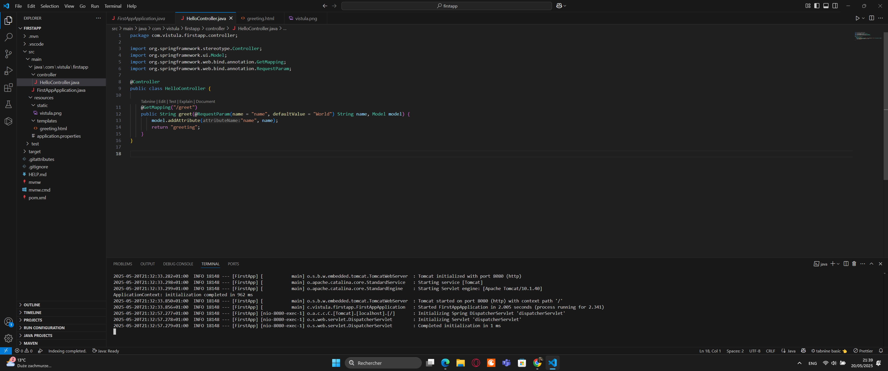
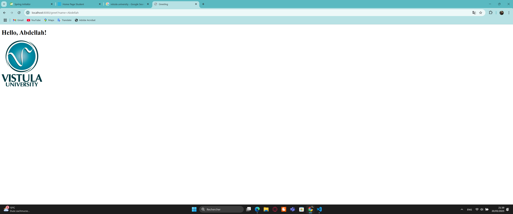

# First Spring Boot Web App

This is a simple Spring Boot application created for university assignment.

It includes:
- A controller that handles HTTP GET requests
- Thymeleaf template rendering
- URL parameter reading (`/greet?name=Abdellah`)
- An embedded image

## How to Run

1. In terminal:




```bash
./mvnw spring-boot:run
